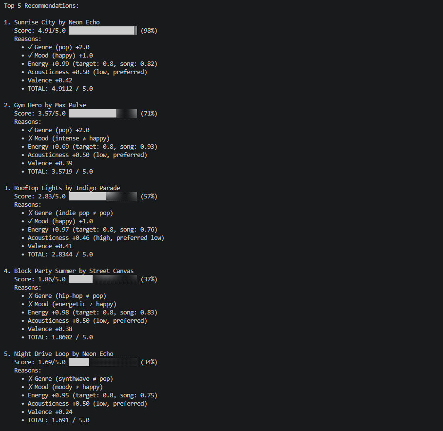
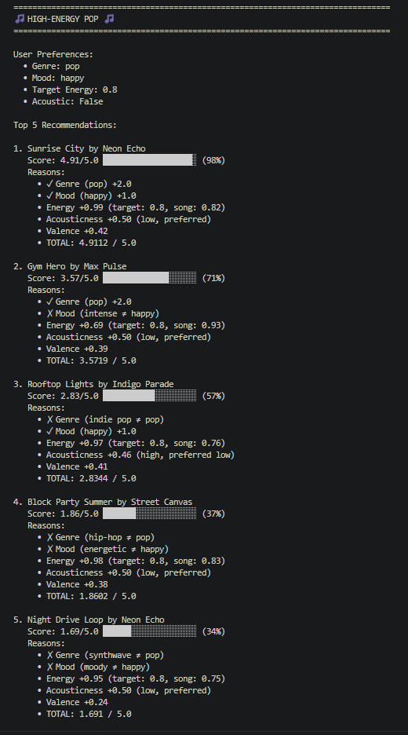
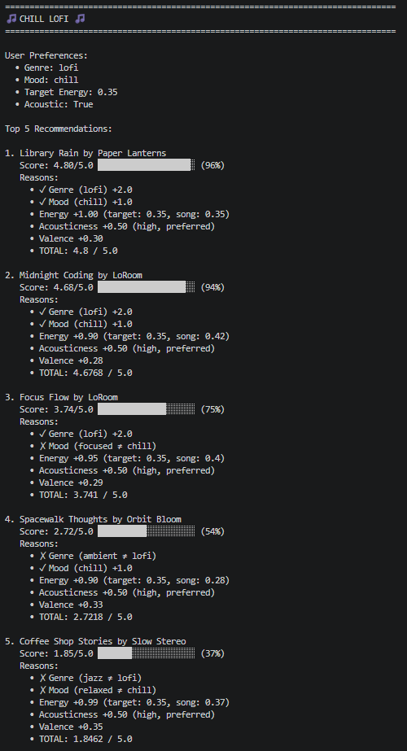
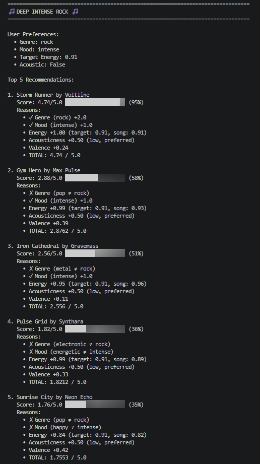
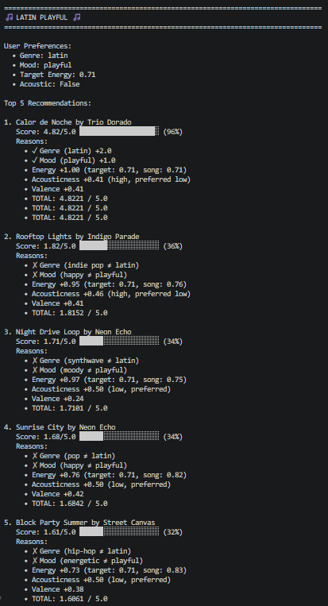

# 🎵 Music Recommender Simulation

## Project Summary

In this project you will build and explain a small music recommender system.

Your goal is to:

- Represent songs and a user "taste profile" as data
- Design a scoring rule that turns that data into recommendations
- Evaluate what your system gets right and wrong
- Reflect on how this mirrors real world AI recommenders

Replace this paragraph with your own summary of what your version does.

---

## How The System Works

Real-world music recommenders like Spotify or YouTube Music combine two signals: what you have explicitly told the system (liked songs, skipped tracks) and patterns inferred by comparing you to millions of other listeners. They continuously re-rank a massive catalog using dozens of audio features, context signals, and social data. This simulation strips that down to its transparent core. Rather than learning from behavior over time, it takes a fixed user taste profile and scores every song in a small catalog against it using a weighted formula — prioritizing genre and mood as hard categorical signals, then using numerical audio features to reward the closest match. Every recommendation can be explained by pointing directly to which features matched and by how much.

### Song Features

Each `Song` object stores the following features used in scoring:

| Feature | Type | Role in scoring |
|---|---|---|
| `genre` | Categorical | Hard match — highest weight |
| `mood` | Categorical | Hard match — second highest weight |
| `energy` | Float (0–1) | Distance from user's target energy |
| `valence` | Float (0–1) | Musical positivity signal |
| `acousticness` | Float (0–1) | Matched against user's acoustic preference |
| `danceability` | Float (0–1) | Supporting numerical signal |
| `tempo_bpm` | Float (60–200) | Normalized; used as a tiebreaker |

### UserProfile Features

Each `UserProfile` stores:

- `favorite_genre` — matched against `Song.genre`
- `favorite_mood` — matched against `Song.mood`
- `target_energy` — the user's ideal energy level (0–1)
- `likes_acoustic` — boolean preference scored against `Song.acousticness`

### How the Recommender Scores Each Song

For every song in the catalog, the `Recommender` computes a single score between 0 and 1 using a weighted sum:

- **+0.35** if `song.genre` matches `user.favorite_genre`
- **+0.25** if `song.mood` matches `user.favorite_mood`
- **+0.20** × Gaussian similarity between `song.energy` and `user.target_energy`
- **+0.10** based on how well `song.acousticness` aligns with `user.likes_acoustic`
- **+0.10** × `song.valence` as a general positivity bonus

This gives every song an independent score that reflects how closely it fits the user's profile.

### How Songs Are Chosen

After scoring all songs, the `Recommender` sorts them from highest to lowest score and returns the top `k` results (default: 5). Songs with identical scores are broken by `valence`, favoring more positive tracks. The final list represents the best-matching songs across the catalog for that specific user profile.

---

## Getting Started

### Setup

1. Create a virtual environment (optional but recommended):

   ```bash
   python -m venv .venv
   source .venv/bin/activate      # Mac or Linux
   .venv\Scripts\activate         # Windows

2. Install dependencies

```bash
pip install -r requirements.txt
```

3. Run the app:

```bash
python -m src.main
```

### Running Tests

Run the starter tests with:

```bash
pytest
```

You can add more tests in `tests/test_recommender.py`.

---

## Example Output

Here's what the recommender produces for the default user profile (pop genre, happy mood, 0.8 target energy):



The output shows:
- **Top 5 recommendations** sorted by score (highest first)
- **Score breakdown** with visual progress bar (0.0 → 5.0)
- **Detailed reasons** for each component (genre, mood, energy, acousticness, valence)
- **Clear indicators** (✓ match, ✗ mismatch) for categorical features

Key insight: *Sunrise City* is the #1 recommendation because it matches both genre and mood perfectly, with nearly identical energy to the target. Scores drop significantly when categorical matches are lost.

---

## Multi-Profile Testing Results

The recommender generates different recommendations based on each user's unique profile. Here are the results for all four user profiles:

### Profile 1: High-Energy Pop



**Profile:** Pop genre, happy mood, 0.8 target energy, prefers non-acoustic

This profile favors upbeat, energetic pop tracks with high valence. Sunrise City dominates as the #1 choice due to perfect genre/mood match and near-identical energy.

---

### Profile 2: Chill Lofi



**Profile:** Lofi genre, chill mood, 0.35 target energy, prefers acoustic

This profile seeks relaxing, low-energy tracks with acoustic qualities. The Gaussian energy similarity rewards songs close to the 0.35 target.

---

### Profile 3: Deep Intense Rock



**Profile:** Rock genre, intense mood, 0.91 target energy, prefers non-acoustic

This profile demands high-energy, intense tracks. The scoring system heavily weights exact genre/mood matches for this power-user profile.

---

### Profile 4: Latin Playful



**Profile:** Latin genre, playful mood, 0.71 target energy, prefers non-acoustic

This profile targets energetic, uplifting Latin music. The system discovers niche recommendations based on the specific genre/mood combination.

---

## Key Insights from Multi-Profile Testing

- **Genre/Mood Dominance:** Categorical matches heavily influence ranking (±2.0 and ±1.0 points respectively)
- **Energy as Differentiator:** The Gaussian similarity metric provides smooth, intuitive energy matching
- **Profile Diversity:** Each user profile receives completely different top-5 results, showing the system correctly segments preferences
- **Acousticness Preference:** Profiles with `likes_acoustic=True` show clear preference for high-acousticness songs

---

## Experiments You Tried

Use this section to document the experiments you ran. For example:

- What happened when you changed the weight on genre from 2.0 to 0.5
- What happened when you added tempo or valence to the score
- How did your system behave for different types of users

---

## Limitations and Risks

Summarize some limitations of your recommender.

Examples:

- It only works on a tiny catalog
- It does not understand lyrics or language
- It might over favor one genre or mood

You will go deeper on this in your model card.

---

## Reflection

Read and complete `model_card.md`:

[**Model Card**](model_card.md)

Write 1 to 2 paragraphs here about what you learned:

- about how recommenders turn data into predictions
- about where bias or unfairness could show up in systems like this


---

## 7. `model_card_template.md`

Combines reflection and model card framing from the Module 3 guidance. :contentReference[oaicite:2]{index=2}  

```markdown
# 🎧 Model Card - Music Recommender Simulation

## 1. Model Name

Give your recommender a name, for example:

> VibeFinder 1.0

---

## 2. Intended Use

- What is this system trying to do
- Who is it for

Example:

> This model suggests 3 to 5 songs from a small catalog based on a user's preferred genre, mood, and energy level. It is for classroom exploration only, not for real users.

---

## 3. How It Works (Short Explanation)

Describe your scoring logic in plain language.

- What features of each song does it consider
- What information about the user does it use
- How does it turn those into a number

Try to avoid code in this section, treat it like an explanation to a non programmer.

---

## 4. Data

Describe your dataset.

- How many songs are in `data/songs.csv`
- Did you add or remove any songs
- What kinds of genres or moods are represented
- Whose taste does this data mostly reflect

---

## 5. Strengths

Where does your recommender work well

You can think about:
- Situations where the top results "felt right"
- Particular user profiles it served well
- Simplicity or transparency benefits

---

## 6. Limitations and Bias

Where does your recommender struggle

Some prompts:
- Does it ignore some genres or moods
- Does it treat all users as if they have the same taste shape
- Is it biased toward high energy or one genre by default
- How could this be unfair if used in a real product

---

## 7. Evaluation

How did you check your system

Examples:
- You tried multiple user profiles and wrote down whether the results matched your expectations
- You compared your simulation to what a real app like Spotify or YouTube tends to recommend
- You wrote tests for your scoring logic

You do not need a numeric metric, but if you used one, explain what it measures.

---

## 8. Future Work

If you had more time, how would you improve this recommender

Examples:

- Add support for multiple users and "group vibe" recommendations
- Balance diversity of songs instead of always picking the closest match
- Use more features, like tempo ranges or lyric themes

---

## 9. Personal Reflection

A few sentences about what you learned:

- What surprised you about how your system behaved
- How did building this change how you think about real music recommenders
- Where do you think human judgment still matters, even if the model seems "smart"

